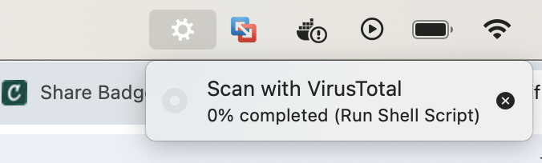

# VirusTotal MacOS Finder Plugin

Adds a 'Scan with VirusTotal' *Quick Action* for files in Finder on MacOS. This quick action, when clicked for a specific file, will initiate a Python3 script (located at `$HOME/.virustotal_plugin/src/main.py`) that gets a SHA256 hash of the selected file, checks on VirusTotal for any matching hashes, and opens a HTML report in the browser if it finds an existing report. If no report/hash is found, the file is uploaded to VirusTotal and scanned with their engines. Once the report from the scan is ready, it is formatted and opened in the browser.

If a hash is found, the report is pulled and opened within 5-10 seconds. If the script must upload the file and wait for VirusTotal to scan, the report will take a few minutes to produce.

<br>

### Prerequisites
1. An API key from VirusTotal is required. Once you have your API key, you should replace "paste_virustotal_api_key_here" with it in `config.ini.example`. **After doing so, rename `config.ini.example` to `config.ini`**

You can create a free account at https://virustotal.com/ to obtain an API key. This script is set up to stay within the rate limits of the free version. For paying users, these limits can be adjusted in the two *while* loops in `scan.py`, specifically the amount of time set in `time.sleep` in main().

2. Python 3 is required. This script was created for Python 3.12.2, but should be compatiable with any Python 3 versions.
    - Some packages are also required. This is installed for you during the installation, but be sure they install correctly or the script will fail.

<br>

### Installation
``` bash
# 1. Clone repository
git clone https://github.com/adammgourley/VirusTotal-MacOS-Finder-Plugin.git

# 2. CD into downloaded folder
cd VirusTotal-MacOS-Finder-Plugin/

# 3. Rename config file and add API key
mv config.ini.example config.ini
nano config.ini

# 3. Execute installation script
sh install.sh

# 4. Review for any errors during installation.
# 5. Double check that main.py and scan.py are executable.
ls -l $HOME/.virustotal_plugin/src/main.py && ls -l $HOME/.virustotal_plugin/src/scan.py
```

<br>


### Using the plugin

After you've reviewed the output from running `install.sh` to ensure no errors occured, you are ready to use the plugin. To test it out, I recommend opening your Downloads folder in Finder, finding a small-medium size file (1-10 megabytes), right-clicking, hovering over Quick actions, and selecting *Scan with VirusTotal*.

It could take up to 2-3 minutes to complete. After which, you will see a browser window open with a report containing the results of the VirusTotal scan.

You will know the action is running by seeing the gear icon in your top menu bar. As seen in this screenshot:



<br>

### Troubleshooting, Logs, and Report History

If you did not see a report open in the browser, you should check the following location for indicators as to what went wrong.
``` bash
# Logs for stdout & stderr
ls $HOME/.virustotal_plugin/logs
```

All reports are saved to the following location.

``` bash
# Directory that stores all reports generated or downloaded via this script
ls $HOME/.virustotal_plugin/reports
```
